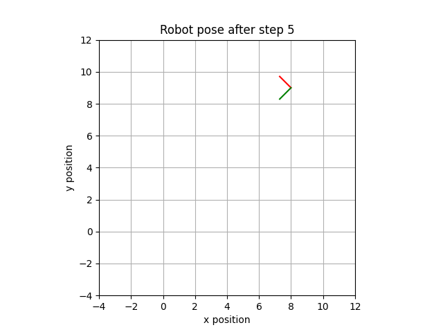
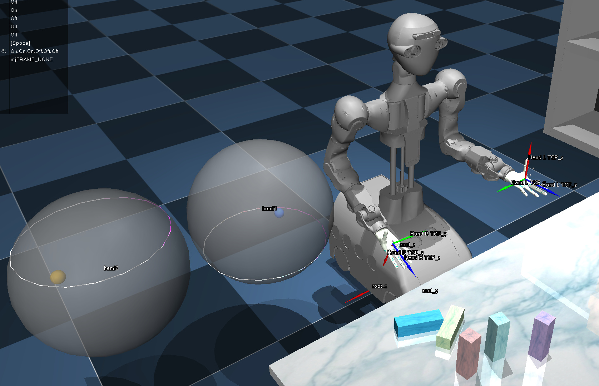

# Robotics I

Here you can find code related to the lecture Robotics I. For installation instructions, [see below](#installation)

## Content

### Sheet 1

#### Exercise 3 (Visualization of Transformations)

[./sheet-1-exercise-3__visualization-of-transformations/](./sheet-1-exercise-3__visualization-of-transformations/)

What does applying a homogeneous transformation matrix yield, if it contains both a (non-identity) rotation and translation? And what is the effect of multiplying from the left vs. from the right? Visualize the solution of exercise 3 and play around with the parameters using this simple python script. It is an all-in-one file written to be easily understandable, and just requires a very few common python packages (numpy and matplotlib).



### Sheet 2

#### Exercise 1 (Transformations)

[./sheet-2-exercise-1__transformations/](./sheet-2-exercise-1__transformations/)

While exercise 1.3 was about applying the transformation, with just the option to try out the effect of performing the calculations differently, this exercise 2.1 is now about systematically investigating
- How a homogeneous transformation matrix is interpreted
- How to convert poses between coordinate systems
- How a transformation applied from the left acts compared to one applied from the right

### Addition 1 (Robotics Toolbox)

[./sheet-2-addition-1__robotics-toolbox/](./sheet-2-addition-1__robotics-toolbox/)

This example shows how to load a Franka Emika "Panda" robot into the simulation of the Robotics Toolbox, and to move it by setting a task space goal for its end effector.

### Addition 2 (MuJoCo)

[./sheet-2-addition-2__mujoco/](./sheet-2-addition-2__mujoco/)

This notebook, [shared with the lecture on Mechano-Informatics](https://git.h2t.iar.kit.edu/teaching/code/mechano-informatics/-/tree/master/ch1_spatial_transformation), shows how to use the MuJoCo simulation in a jupyter notebook and contains multiple visualizations for spatial transformations.



## Installation

**Note:** *The code in this repository was mainly tested in Linux (Ubuntu). We also provide instructions for other OS, and it should
also work on Windows and Mac but the behavior might be slightly different.*

### Download the Code

1. Make sure you have git installed on your computer. Then, clone the repository:
   ```shell
   cd /A/folder/on/your/system/to/store/the/code
   git clone https://git.h2t.iar.kit.edu/teaching/code/robotics-i.git
   cd robotics-i
   ```
   * If you are not familiar with git, you can also download the code as a zip file from 
   the [repository's web interface](https://git.h2t.iar.kit.edu/teaching/code/robotics-i) 
     * Top right of this page "code" button -> "Download source code" -> "zip"
     * unzip it to the desired location.

### Setup a Virtual Environment

1. Decide which management tool you want to install for your virtual environments. Depending on your operating system, you can choose between these options:
   - Windows: use *conda* (recommended, *virtualenv* also possible)
   - Linux: use either *conda* or *virtualenv*
   - MacOS: use *conda*

   Perform the installation depending on your decision:

   1. If you decided for *conda*:
      - Follow the [official instructions](https://docs.conda.io/projects/miniconda/en/latest/#quick-command-line-install).
        Depending on which system (Windows, macOS, or Linux) you are working on, you need to follow the different instructions on that page.
        See also troubleshooting sections below.
      - Open a shell or terminal from your system and run the following.
         - Windows: search the program `Anaconda Prompt` and run it. See also the troubleshooting section below.
         - Linux: `Ctrl + Alt + T`
      - Create a virtual environment. In the shell or terminal, run
        ```shell
        conda create -n robotics-i python=3.10
        ```
      - Activate the created virtual environment. In the shell or terminal, run
        ```shell
        conda activate robotics-i
        ```

   1. If you decided for *virtualenv*:
      - Install virtualenv:
         ```shell
         sudo apt install python3-virtualenv
         ```
      - Create a virtual environment ("venv" is the path where it is installed to, and may be changed):
         ```shell
         virtualenv venv
         ```
      - Activate the created virtual environment:
         ```shell
         source venv/bin/activate
         ```

3. Install dependencies:
   ```shell
   pip install -r requirements_all.txt
   ```

### Using the Jupyter Notebooks

1. Activate created virtual environment if not already active.
   1. If you are using *conda*:
      - In the shell or terminal, run
         ```shell
         conda activate robotics-i
         ```
   2. If you are using *virtualenv*:
      - In the shell or terminal, run
         ```shell
         source venv/bin/activate
         ```
2. In the robotics-i directory, run jupyter-notebook server
   ```shell
   jupyter notebook
   ```

3. View the notebooks. A web-browser will pop up showing the current directory (should be the robotics-i folder). 
   You might be asked how you want to open the file, chose your favorite web-browser.
   If it doesn't open by itself, you can copy the link in the shell or terminal and paste it to your web-browser, or press ctrl and click
   the link. Navigate to the folder of the exercise you want to work on and open the notebook file.
   - The notebook files end with a `.ipynb` extension.
   - Open a notebook in the web interface.
   - You can now explore the notebook by running the cells one by one and editing the code to experiment with the example.


#### About Jupyter Notebook

Most examples are implemented in a [Jupyter Notebook](https://jupyter.org/).
To run them, activate the example's virtual environment and run `jupyter notebook`:

```bash
cd path/to/the/example

jupyter notebook
```

A web-page should automatically be opened it your web browser.
If not, open the URL that is printed by the `jupyter notebook` command
(e.g. `file:///home/user/.local/share/jupyter/runtime/nbserver-22023-open.html`)

The notebook files end with a `.ipynb` extension.
Open a notebook in the web interface.

You can now explore the notebook by
running the cells one by one and editing the code to experiment with the example.


### Troubleshooting

#### Setup conda environment on Windows

Installation:

```shell
cd /some/temporal/folder/on/your/machine
curl https://repo.anaconda.com/miniconda/Miniconda3-latest-Windows-x86_64.exe -o miniconda.exe
start /wait "" miniconda.exe /S
del miniconda.exe
```

if `start` command does not work. Then you can also open the folder in the file manager program `Explorer` and double click
the downloaded `miniconda.exe` and follow the instructions in the GUI.

After installation, you can search the program `Anaconda Prompt` and run it.

If you want to change the default working directory to the robotics-i code folder, you can follow the instructions below:
- Go to Start and search for `Anaconda Prompt`
- Right click `Anaconda Prompt` and choose `Open File Location`, which will open a folder of shortcuts.
- Right click the `Anaconda Prompt` shortcut
- Choose `Properties` and
- You can now adjust the starting dir in the `Start in` box, replace it with the path to your robotics-i code folder


#### Setup conda environment on Linux

Open a terminal, or `Ctrl+Alt+T`
```shell
mkdir -p ~/miniconda3
wget https://repo.anaconda.com/miniconda/Miniconda3-latest-Linux-x86_64.sh -O ~/miniconda3/miniconda.sh
bash ~/miniconda3/miniconda.sh -b -u -p ~/miniconda3
rm -rf ~/miniconda3/miniconda.sh
# For bash
~/miniconda3/bin/conda init bash
# For zsh
~/miniconda3/bin/conda init zsh
```

#### Swift Display Error 
Under windows a known issue is that the swift display (eg. in sheet2 addition 1, `Robotics_Toolbox_Example.ipynb`, cell 3) 
can result in an error. If you encounter this issue, you can 
* Try to restart the notebook's python kernel (toolbar -> arrow icon)
* Try to run the environment with rtc as communication backend by using 
  * `env.launch(realtime=True, browser="notebook" if not params.open_simulation_in_new_tab else None, comms='rtc')`
  * This is already prepared in the code.