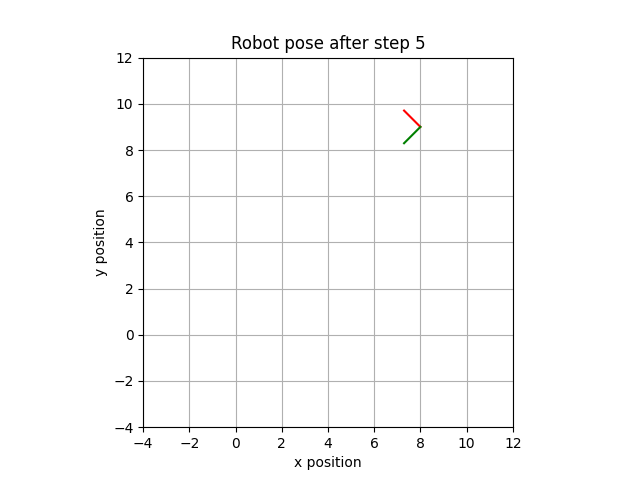

# Robotics I

Here you can find code related to the lecture Robotics I.

## Exercise Sheet 1

### Exercise 3 (Concatenation of Coordinate Transforms)

What does applying a homogeneous transformation matrix yield, if it contains both a (non-identity) rotation and translation? And what is the effect of multiplying from the left vs. from the right? Visualize the solution of exercise 3 and play around with the parameters using this simple python script. It is an all-in-one file written to be easily understandable, and just requires a very few common python packages (numpy and matplotlib).

